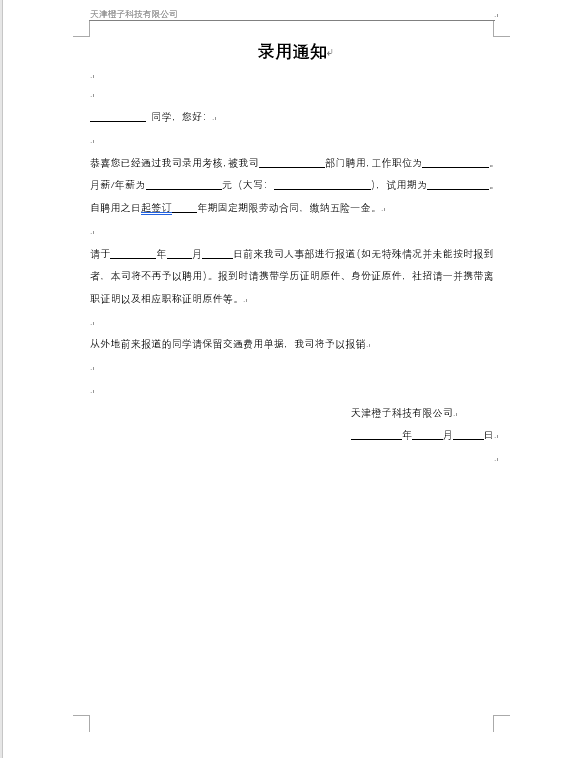
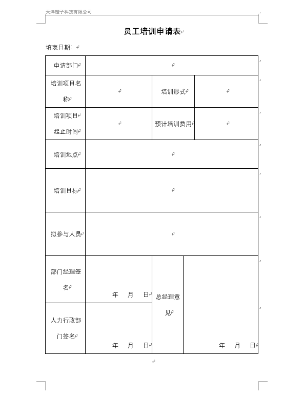
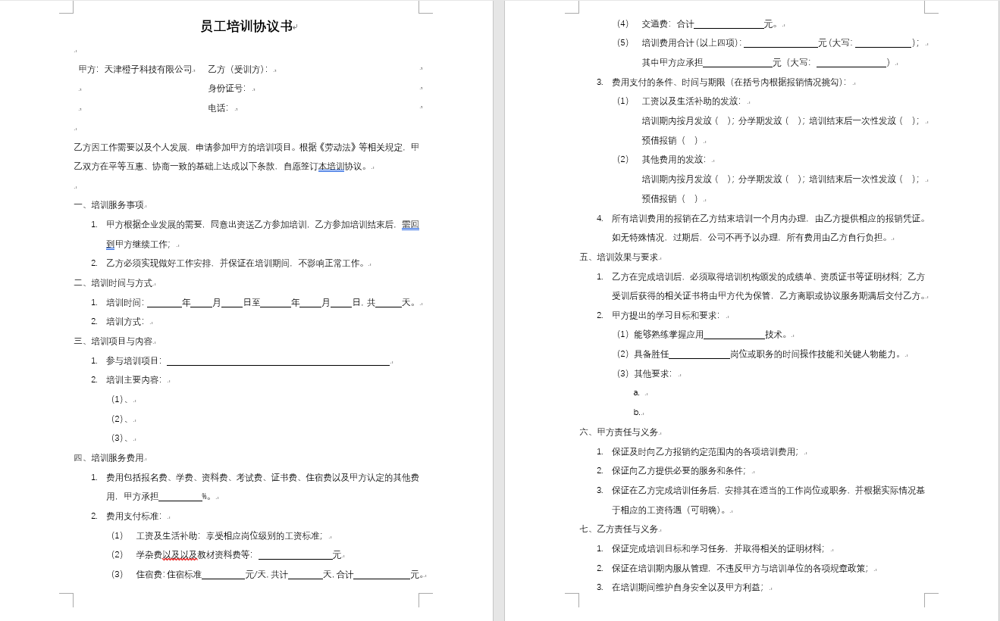
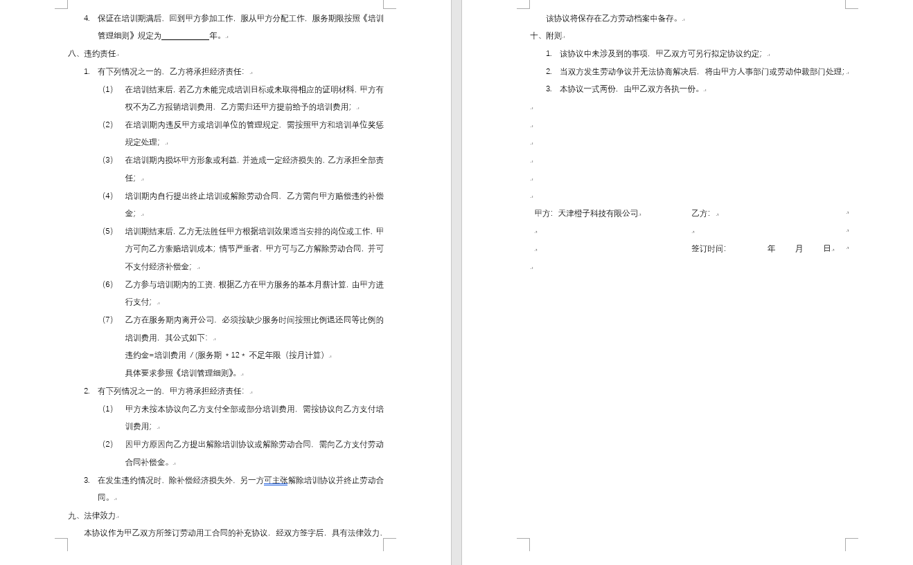
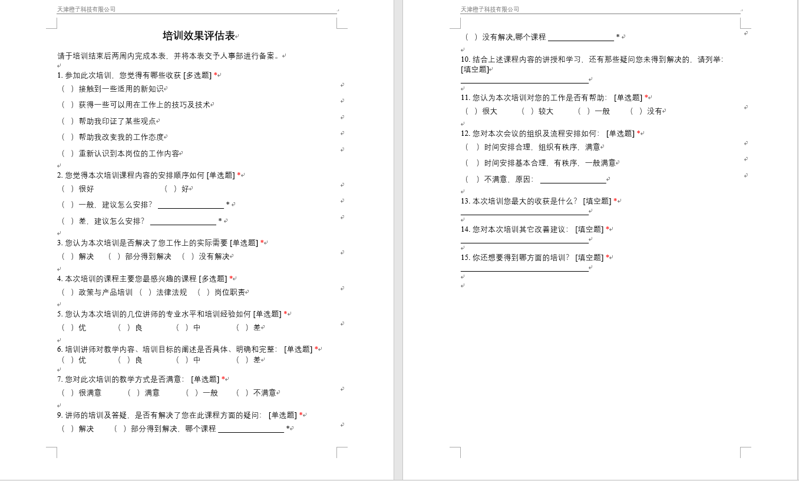

## 招聘管理细则

1. 招聘原则

   公司根据年度发展计划和工作目标制定员工招聘计划，以择优录取的原则进行人员筛选。筛选要求重能力、重品德、重素质；认同行业、认同企业文化；具有较好的团队协作意识。

2. 招聘方式

   通过内部推荐、员工自荐和外部招聘方式来招聘人员。

   * 内部推荐：员工可根据公司需要推荐相应的人员。
   * 员工自荐：公司职位有空缺时，将优先考虑从员工内部进行提拔，员工也可根据自身情况进行自荐。
   * 外部招聘：人事部通过网络、猎头、人才市场等媒介进行招聘。

3. 招聘流程

   1. 人事部选定招聘渠道，向外发布招聘信息，并接收简历，根据招聘职位的具体要求对招聘人员的素质和技能要求进行初步筛选；
   2. 人事部对筛选的候选人进行电话面试，进行再一次的筛选并安排面试；
   3. 面试由人事部和用人部门共同完成，对应聘人员的智力、品德、经验、能力等进行综合考察和评价，选拔合格人员进入录用环节；
   4. 由人事部向拟录用人员发放 *《录用通知》*；
   5. 被录用人员根据录用通知时间，携带相应资料到公司进行报道，如在规定时间内未正常报道，视作自动放弃，取消录用资格，特殊情况除外。

   ```flow
   st=>start: 开始
   e=>end: 淘汰
   op1=>operation: 筛选
   op2=>operation: 电话面试
   cond1=>condition: 符合要求?
   cond2=>condition: 符合要求？
   op3=>operation: 面试
   io=>inputoutput: 录用
   
   st(right)->op1(right)->op2(right)->cond1
   cond1(yes)->op3->cond2
   cond1(no)->e
   cond2(yes)->io
   cond2(no)->e
   ```

4. 员工聘用

   1. 有以下情形之一的人员，不得被聘用为本公司员工：

      - 被剥夺公民权利者；

      - 通缉在案未撤销者；

      - 受有期徒刑宣告，未结案者；

      - 经指定医院体检不合格者；

      - 患有精神疾病或传染病或使用任何毒品者；

      - 未满16周岁者；

      - 政府法规规定的其他情形者。

5. 特殊人员

   对于财务、出纳等特殊人员，招聘时需进行背景调查，确保员工信用记录良好，无任何不良记录。

6. 工程师招聘
   1. 入职后要求
   * 八大方向选三个
     * 八大方向：前端、后端、文档、大数据、项目管理、测试、交付、系统研发
   * 按时完成分配的要求
   2. 入职流程
   * 将有一周的面试时间，主要进行git技术的学习：在这一周内，考察候选人的学习能力和发展空间;
   * 一周后如能成功转正，将安排一个月到三个月不等的试用期，试用期内表现优异的员工可提前转正。


## 培训管理细则

1. 内容以及受众

   * 目标对象：公司全体员工；
   * 人力部门负责规划与支持工作；
   * 用人部门领导可在日常工作中根据实际工作需要提出培训需求。

2. 入职培训

   新员工在入职当天，将由人力部和用人部门进行简单的入职培训，内容包括公司基本情况与公司制度的简单介绍，企业文化的初步学习，工作环境以及公司同事的熟悉。

3. 员工培训

   1. 新员工培训

      公司实行导师制，每位新员工将拥有一位专属导师，帮助新员工熟悉工作和业务能力的提升。导师将负责新员工试用期的评价和转正评分。

   2. 日常培训

      人事部将根据部门需要组织公司内部的培训，整合公司内部的培训资源，选取部门内业务能力较高的员工担任内部培训师。对于培训师员工，公司将给予一定数额的培训补贴或奖励。

4. 员工外培

   1. 部门根据工作业务需要填写 *《培训申请》*，确定外训课题、参训人员名单以及可寻找的外训方；

   2. 人事部根据公司政策，制定方案，对部门提交的参训人员进行材料和和真实性核查，核实外训方的资质和能力，最终确定参训人员名单和外训方；

   3. 外训的食宿费、差旅费按照公司报销标准执行，如有变化，向总经理进行签字批准；
 
   4. 签订 *《员工培训协议》*，在与员工协商之后签字确认，公司与个人各持一份。

      ```flow
      st=>start: 部门申请
      e=>end: 结束
      op1=>operation: 人力核查
      op2=>operation: 人力确认
      op3=>operation: 签订协议
      cond1=>condition: 材料是否属实
      io=>inputoutput: 开始培训
      
      st(right)->op1(right)->cond1
      cond1(yes,right)->op2->op3->io
      cond1(no)->e
      ```

      

   5. 关于员工服务期与违约金：

      - 根据《劳动合同法》第二章第二十二条规定，用人单位为员工提供专项培训费用，对其进行专业技术培训的，可以与员工约定服务期。员工违反服务期约定的，应当按照约定向公司赔偿不超过公司提供的培训费用的违约金。

      - 培训费用包括：讲师费、资料费、食宿费、差旅费、证书费等全部费用；

      - 服务期：

        服务期指自员工参与的专项培训结束至劳动合同终止（包含顺延的服务期），单次参加培训结束后最长服务期限不超过8年；如一年内多次参加专项培训，培训费用从第二次起如同前期培训费用隶属同一档次的按照下表所示进行顺延：

        | 参训费用（单次）          | 首次培训服务期 | 递增服务期 |
        | ------------------------- | -------------- | ---------- |
        | 100 &le; 培训费用 < 800   | 1年            | 0.5年      |
        | 800 &le; 培训费用 < 1500  | 2年            | 1年        |
        | 1500 &le; 培训费用 < 3000 | 3年            | 1.5年      |
        | 3000 &le; 培训费用 < 5000 | 5年            | 2年        |
        | 5000 &le; 培训费用        | 5年以上        | 3年        |

      - 违约金

        违约金指员工在服务期内离开公司，按缺少服务时间按照比例退还同等比例的培训费用，期公式如下：

        违约金=培训费用 &divide; (服务期 &times; 12) &times; 不足年限（按月计算）

        注：在计算违约金时，若当月服务期不小于15个工作日，按照服务期计算；若当月服务期小于15个工作日，按照整月计入违约金范围。

   6. 协议

      对于考取各类资格证书的培训，如果考取证件所产生的一切费用是由公司部分/全部承担（低于100元签订一年），则考取的资格证书归公司所有，由人事部门进行保管。员工服务期到期后离职可到人事部取回。若员工在合同期或服务期内离职需缴纳公司所负担的费用之后方可取回。

   7. 外培评估

      外培人员在返回上班一周后，应将培训证书、学习材料、笔记（复印件）交至人事部进行备份；

      参与培训人员应根据培训内容，填写 *《培训效果评估表》*，并在两周之内向人事部提交培训小结，向直接主管根据培训内容提交工作改进建议；

      部门直接主管结合改进建议对员工培训项目实施情况进行评价，并将评价结果反馈给公司人事部。

   8. 培训报销

      员工在结束培训回到公司后，依据培训费用报销凭证，到人事部门办理报销事宜；

   9. 培训人员义务

      1. 短期培训（一个月内/次）

         具有反训义务

      2. 长期培训（包含学历教育）

         选择至少一个相关主题，结合公司现实进行诊断分析，确认存在的问题、原因，并给出改进的方案，并对公司相关人员进行针对性培训。

   10. 反训

       * 参与培训人员在返回公司两周内，做出与公司实际事宜相关的转训内容（形式包括幻灯片、讲义、考试题等），交予人事部门；

       * 培训人员配合公司人事部门制定转训计划，并填写相关的培训计划表进行公示，接受公司员工报名参加，一周内进行转训；

       * 培训计划：转训内容、时间、课件、签到表、评估表等

         


## 薪酬管理细则


## 考勤管理细则

公司人事部负责员工的考勤管理，员工的出差申请、公出申请、请假申请以及异常处理统一交由人事部进行备案。

1. 对非技术人员的规定

   1. 工作时间

      * 本公司实行固定工作时间制，基本工作时间为上午十点至下午四点，保证在此时间段内至少有一名员工留在公司，周末实行双休；
      * 员工因公出差或因其他原因必须于公司场外从事工作的，不易计算其工作时间，以正常工作时间作为计算；

   2. 旷工定义以及处理办法

      1. 有以下情形之一的属于旷工行为：

         - 员工未办理请假手续或并未提前与人事部进行报备，私自不来公司上班；
         - 工作时间未经上级允许，擅自离开岗位，其离岗时间按照旷工处理；
         - 其他细则中提到的各种情况；

      2. 处理办法

         旷工在本公司属于严重违纪，公司将视情节严重程度进行处理。

         * 员工连续三天旷工，视为自离，公司将不予发放当月薪资；
         * 每月累计旷工三天或以上，或全年累计旷工十天或以上，公司将开除该位员工；
         * 因员工旷工而对公司造成损失的，公司保留追究其法律责任的权利；

2. 对技术人员的规定

   1. 工作时间

      - 本公司实行弹性工作制，不强制要求上班时间，员工每日基本工作时间为8小时/日，周末实行双休；
      - 员工因公出差或因其他原因必须于公司场外从事工作的，不易计算其工作时间，以正常工作时间作为计算；

   2. 旷工定义以及处理办法

      1. 有以下情形之一的属于旷工行为：

         * 技术研发人员无故不回公司以及客户的电话和信息，累计三次无故不回记一次旷工；
         * 无故未按时完成分配的任务，从而导致整个项目进程延误，对公司造成损失；

      2. 处理办法

         旷工在本公司属于严重违纪，公司将视情节严重程度进行处理。

         - 员工连续三天旷工，视为自离，公司将不予发放当月薪资；
         - 每月累计旷工三天或以上，或全年累计旷工十天或以上，公司将开除该位员工；
         - 因员工旷工而对公司造成损失的，公司保留追究其法律责任的权利；

         


## 入职管理细则

1. 新员工入职流程

   1. 新员工按照*《录用通知》*通知的时间，并携带相应的证件到达公司；

   2. 人事部员工为新员工建立员工简历，包括：劳动合同，身份证、毕业证/在校生提供学生证，职业资格证书以及银行卡。人事部查验原件，留存复印件。新员工在人事员工的帮助下填写相关的入职资料，存放于档案中；

   3. 行政部为新员工安排工位、办公用品，并将员工加入相应大的工作群；

   4. 人事部员工带领员工进行入职培训。

      ```flow
      st=>start: 员工报道
      e=>end: 结束
      op1=>operation: 人事部建立员工档案
      op2=>operation: 行政部安排工位、加工作群
      op3=>operation: 岗前培训
      
      st->op1->op2->op3->e
      ```

      

2. 试用期规定

   * 试用期根据所签订的劳动合用的时间约定为1-3个月，具体的试用期时间由行政人事部与用人部门在录用之 前商议确定；
   * 在试用期内表现优秀的新员工可提前转正，由部门领导向行政人事部门提出，经过考核通过后可以提前办 理转正。

3. 转正管理

   * 新员工试用期结束一周前，人事部将发放*《试用期工作总结》*由员工个人填写，员工将对自己在试用期内  的表现进行评价，行政人事部门及用人部门领导（个人导师）将通过*《试用期考核表》*对新员工进行考评；

   * 若新员工在试用期内达不到公司要求，由用人部门领导或行政人事部门出具证据并向员工本人进行说明 后，由其部门领导填写*《辞退通知书》*，经行政人事部门确认后，办理相关手续；

     


## 异动管理细则

1. 晋升

   1. 公司出现职位空缺或因业务发展、部门工作需要，应优先考虑公司内部工作勤奋、表现出色、能力出众并 达到任职要求的员工；

   2. 升职后的员工将享受相应职务的薪金以及各项待遇。

2. 调职

   1. 公司因业务发展或部门工作需要时，会对相应岗位的员工进行内部调动，重新作出工作安排，调动人员可 根据自身实际情况，如实在无法接受调岗，可向行政人事部门提出，理由充分者可另做安排；接受调岗的 员工应及时将现有工作向原工作部门进行交接；

   2. 人事部对关键信息安全岗位进行年度考察，对于不符合安全要求的员工进行岗位调整；

3. 降职

   1. 公司对无法胜任本职工作或因工作失误给公司带来损失者，视情节严重程度予以降职，被降职的员工，其 相应的薪资待遇也将随之降低。

4. 离职

   1. 辞职
      1. 在未出现员工可随时向公司解除劳动合同的情形下，正式员工提前30天，试用期员工提前3天向公司   提出书面辞职申请，填写*《员工离职申请表》*，经员工所在部门领导签字，人事部门确认后可办理相  应手续。
      2. 人事部门负责对辞职员工进行面谈，了解辞职原因，并向用人部门领导反馈；员工在离职前必须认真 向公司及工作接手人办理离职工作交接程序，完成*《离职手续交接表》*和*《离职手续办理单》*经经手  人及部门领导签字确认后方可办理离职手续，否则将推迟办理离职工资的结算；
      3. 员工与人事部填写*《劳动合同终止情况说明》*后，可于在职最后一天至人事部领取*《离职证明》*；
      4. 公司不接受任何经电话、邮件、同事或亲友转达的辞职申请，此类人员按照自行离职处理。
      5. 注意事项
         * 离职人员若在入职时与公司签有保密协议的，须根据协议内容在离职后的约定时间内保守公司机密，否则公司有权追究其相关的法律责任；
         * 在完成工作及资料移交，归还所借用及公司发放的办公用品后，并返还须向公司缴付的各项财务费用后，方可进行薪资结算；
         * 员工离职后，若经发现其在职期间有亏空、舞弊或其他非法事项，除应负担的赔偿责任外，情 节严重者，公司将追究其法律责任；
         * 技术人员不得在其参与的项目未结项前离职，否则公司有权拒绝其离职要求，若员工执意离职对公司造成了经济损失，员工需承担全部经济损失；
         * 员工离职还没正式结束前，应在原工作岗位继续工作直至工作移交完毕，并严格遵守公司各项 制度，手续未办完离开公司或出现严重违纪情况时，按照自行离职处理。

   2. 自行离职
      1. 未按照公司规定要求办理离职手续的情况，视为自行离职，公司有权推迟结算所有未结算薪资；
      2. 当员工因辞职而违反劳动合同中的有关规定，给公司造成损失或其他不可预见危害时，公司保留采取 法律手段的权利。

5. 辞退

   1. 有下列情形之一，本公司可以不预先通知而终止聘用关系，并不需给予该员工补偿费：

      * 在欺骗公司的情况下与公司签订劳动合同；
      * 在试用期被证明不符合录用条件；
      * 违反劳动合同或本细则，并给公司造成重大损失的；
      * 营私舞弊，收受贿赂，严重失职，对公司造成重大损害的； 
      * 对公司其他同事实施暴行或有重大侮辱行为而使之受到伤害； 
      * 故意泄露公司技术、经营机密者；
      * 无故旷工3日以上，或一年内累计旷工6日以上； 
      * 被判有期徒刑及以上的刑事责任者；
      * 本公司规章制度规定的其他严肃纪律处分而开除的情形。

   2. 下列情形之一的，本公司将提前三十日以书面形式通知员工本人或者额外支付员工一个月工资后，可 以解除劳动合同：

      * 员工因患病或者非因工负伤，在规定的医疗期满后不能从事原工作，也不能从事由本司另行安 排的工作的；
      * 员工不能胜任工作，经过培训或者调整工作岗位，仍不能胜任工作的；
      * 劳动合同订立时所依据的客观情况发生重大变化，致使劳动合同无法履行，经本司与员工协商，未能就变更劳动合同内容达成协议的；

   3. 当员工达到被辞退条件时，经沟通协商后，行政人事部向辞退员工发出解除劳动合同通知书及离职协 议，被辞退者按照离职程序办理离职交接手续，否则不予以结算工资。

   4. * 员工因患病或者非因工负伤，在规定的医疗期满后不能从事原工作，也不能从事由本司另行安 排的工作的；

      * 员工不能胜任工作，经过培训或者调整工作岗位，仍不能胜任工作的；

      * 劳动合同订立时所依据的客观情况发生重大变化，致使劳动合同无法履行，经本公司与员工协 商，未能就变更劳动合同内容达成协议。


# 附件

## 录用通知


* [录用通知](./assets/docs/admission.docx)


## 培训申请
	

* [培训申请](./assets/docs/trainingapplication.docx)

## 员工培训协议



* [员工培训协议](./assets/docs/trainingaggrement.docx)

## 培训效果评估表


* [培训效果评估表](./assets/docs/trainingeffectevaluationform.docx)

## 